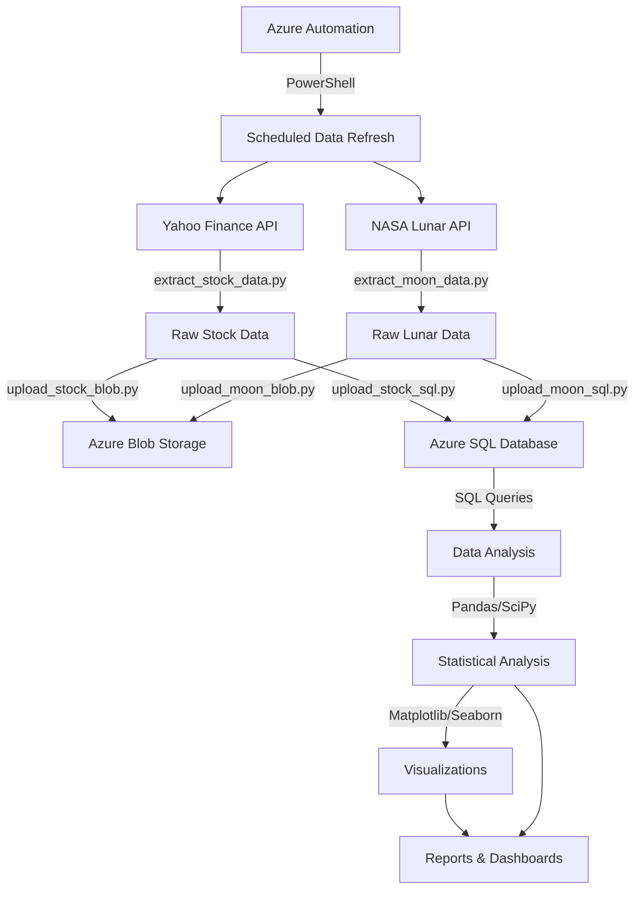
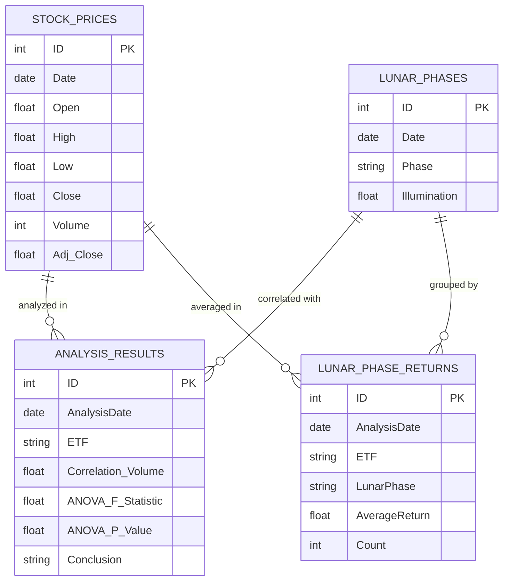

# Stock Market & Lunar Phase Analysis

This project analyzes the relationship between lunar phases and stock market behavior for four major ETFs:

- SPY (S&P 500 ETF)
- QQQ (Nasdaq 100 ETF)
- DIA (Dow 30 ETF)
- IWM (Russell 2000 ETF)

## 📊 Project Overview

This data engineering project investigates whether lunar phases have any statistically significant impact on stock market performance metrics such as:

- Daily returns
- Trading volume
- Price volatility

The analysis uses 5 years of historical data, combining stock market information from Yahoo Finance with lunar phase data from NASA's API to perform correlation analysis and ANOVA tests.

## 🏗️ Data Pipeline Architecture



The data pipeline consists of the following components:

1. **Data Extraction Layer**

   - Python scripts for extracting stock data from Yahoo Finance
   - Python scripts for retrieving lunar phase data from NASA API

2. **Data Storage Layer**

   - Azure Blob Storage for raw data files
   - Azure SQL Database for processed data and analysis results

3. **Data Processing Layer**

   - Python data transformation scripts
   - SQL queries for data aggregation and statistical analysis

4. **Analysis & Visualization Layer**
   - Statistical analysis using pandas, scipy, and numpy
   - Visualization using matplotlib and seaborn libraries

## 🗂️ Project Structure

```
StockMarket-LunarAnalysis/
├── data/                    # Data files
│   ├── raw/                 # Raw data extracted from sources
│   ├── processed/           # Processed data ready for analysis
│   ├── DIA_stock_2025-03-11.csv
│   ├── IWM_stock_2025-03-11.csv
│   ├── QQQ_stock_2025-03-11.csv
│   ├── SPY_stock_2025-03-11.csv
│   └── lunar_phases.csv
├── reports/                 # Analysis reports
│   ├── data_engineering_report.html
│   ├── data_engineering_report.md
│   └── lunar_stock_analysis_report.md
├── scripts/                 # Python and PowerShell scripts
│   ├── extract_stock_data.py        # Extract stock price data
│   ├── extract_moon_data.py         # Extract lunar phase data
│   ├── upload_stock_blob.py         # Upload stock data to Azure Blob
│   ├── upload_moon_blob.py          # Upload lunar data to Azure Blob
│   ├── upload_stock_sql.py          # Transfer stock data to SQL DB
│   ├── upload_moon_sql.py           # Transfer lunar data to SQL DB
│   ├── azure_stock_lunar_analysis.py # Main analysis script
│   └── azure_automation_lunar_analysis.ps1  # Automation script
├── sql/                     # SQL queries
│   └── stock_lunar_analysis_queries.sql  # Analysis queries
├── visualizations/          # Charts and graphs
│   ├── correlation_heatmap.png       # Correlation analysis
│   └── returns_by_lunar_phase.png    # Returns by lunar phase
├── .env                     # Environment variables (credentials)
├── requirements.txt         # Python dependencies
└── README.md                # Project documentation
```

## 📊 Visualizations

### Correlation Heatmap

This heatmap shows the correlation between lunar phases and various stock metrics:


### Returns by Lunar Phase

This chart shows average daily returns for each lunar phase:


## 📝 Database Design



### Database Details

- **Server**: stockdatapipeline-server.database.windows.net
- **Database**: StockPriceDB
- **Tables**:
  - SPY_StockPrices, QQQ_StockPrices, DIA_StockPrices, IWM_StockPrices
  - LunarPhases
  - StockLunarAnalysisResults (ANOVA test results)
  - LunarPhaseReturns (Average returns by lunar phase)

## 🚀 Setup & Requirements

1. Install the required Python packages:

   ```bash
   pip install -r requirements.txt
   ```

2. Set up environment variables:

   - Copy `.env.template` to `.env`
   - Fill in your Azure credentials and connection strings

   ```bash
   cp .env.template .env
   # Edit .env with your credentials
   ```

   Required environment variables:

   - `AZURE_STORAGE_CONNECTION_STRING`: Your Azure Storage Account connection string
   - `AZURE_BLOB_SAS_URL_STOCK`: SAS URL for stock data container
   - `AZURE_BLOB_CONTAINER_STOCK`: Container name for stock data
   - `AZURE_BLOB_SAS_URL_LUNAR`: SAS URL for lunar data container
   - `AZURE_BLOB_CONTAINER_LUNAR`: Container name for lunar data
   - `SQL_ODBC_CONNECTION_STRING`: SQL Server connection string

3. Run the extraction scripts:

   ```bash
   python scripts/extract_stock_data.py
   python scripts/extract_moon_data.py
   ```

4. Upload data to Azure:

   ```bash
   python scripts/upload_stock_blob.py
   python scripts/upload_moon_blob.py
   python scripts/upload_stock_sql.py
   python scripts/upload_moon_sql.py
   ```

5. Run the analysis:

   ```bash
   python scripts/azure_stock_lunar_analysis.py
   ```

## 📈 Analysis Performed

The analysis includes:

1. **Correlation Analysis**: Examines correlations between lunar phases and stock metrics (Close Price, Volume, Returns)
2. **Returns by Lunar Phase**: Calculates average daily returns for each lunar phase
3. **ANOVA Tests**: Checks if trading volume and returns vary significantly by lunar phase
4. **Visualization**: Generates heatmaps and bar charts to visualize the findings

### Statistical Methods

| Analysis Type          | Purpose                          | Tools Used          |
| ---------------------- | -------------------------------- | ------------------- |
| Correlation Analysis   | Measure relationship strength    | Pandas, SciPy       |
| ANOVA Tests            | Test for significant differences | SciPy stats module  |
| Descriptive Statistics | Summarize data distributions     | Pandas, NumPy       |
| Data Visualization     | Present findings visually        | Matplotlib, Seaborn |

## ⚙️ Automation

The analysis can be automated using:

- Azure Automation Account with the included PowerShell script
- Azure Data Factory pipelines
- SQL Server Agent jobs with scheduled queries

## 🔍 Key Findings

The data analysis reveals:

| Lunar Phase     | Average Return (%) | Statistical Significance |
| --------------- | -----------------: | ------------------------ |
| New Moon        |               0.09 | Not significant          |
| Waxing Crescent |              -0.10 | Not significant          |
| First Quarter   |               0.10 | Not significant          |
| Waxing Gibbous  |               0.09 | Not significant          |
| Full Moon       |               0.15 | Not significant          |
| Waning Gibbous  |               0.01 | Not significant          |
| Last Quarter    |               0.15 | Not significant          |
| Waning Crescent |               0.06 | Not significant          |

**Overall Findings:**

- Weak correlations between lunar phases and stock metrics (all below 0.03)
- Some variations in returns across lunar phases, but not statistically significant
- DIA (Dow 30 ETF) shows statistically significant volume variation by lunar phase (p < 0.05)
- Highest average returns during Full Moon (0.15%) and Last Quarter (0.15%) phases
- Lowest average returns during Waxing Crescent (-0.10%)
- Overall, lunar phases do not appear to have a meaningful impact on stock market behavior

## 📋 Further Research

Potential areas for further investigation:

- Analysis of specific industry sectors instead of broad market ETFs
- Inclusion of additional astronomical factors (solar flares, eclipses)
- Longer time period analysis (10+ years)
- Machine learning approaches to detect subtle patterns

## 📚 Reports

- [Comprehensive Data Engineering Report](reports/data_engineering_report.html)
- [Lunar Stock Analysis Findings](reports/lunar_stock_analysis_report.md)

## 📑 License

This project is licensed under the MIT License.

## 👨‍💻 Author

Created as part of an Azure Data Engineering project.
