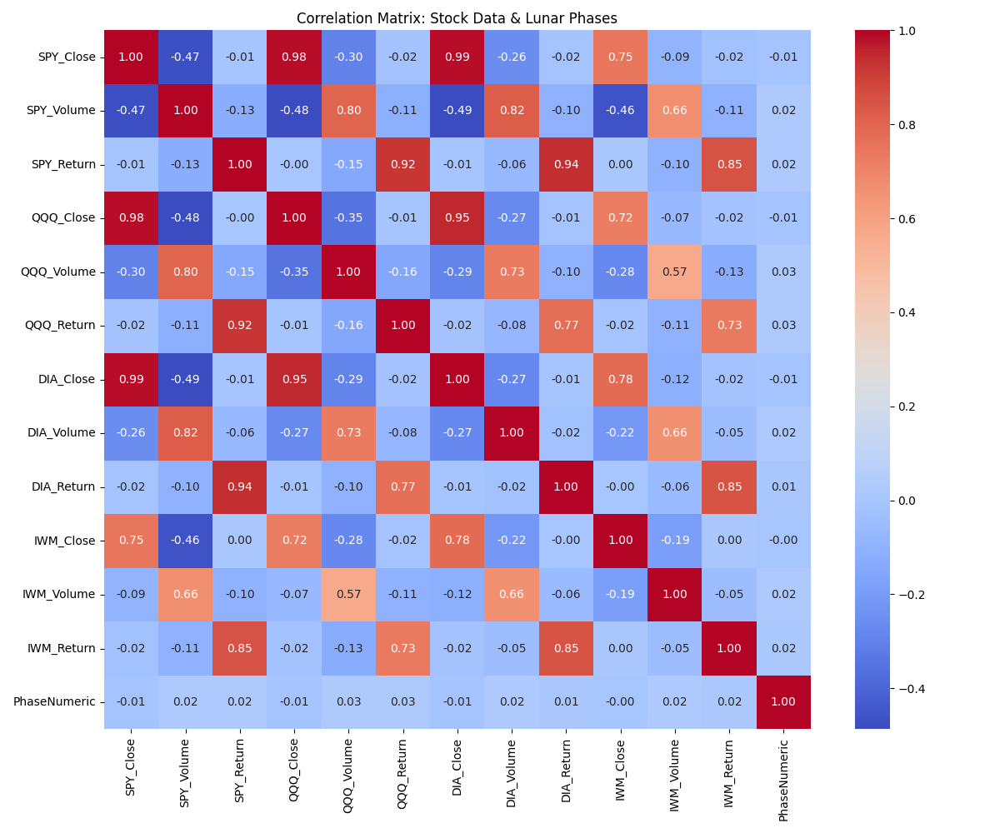
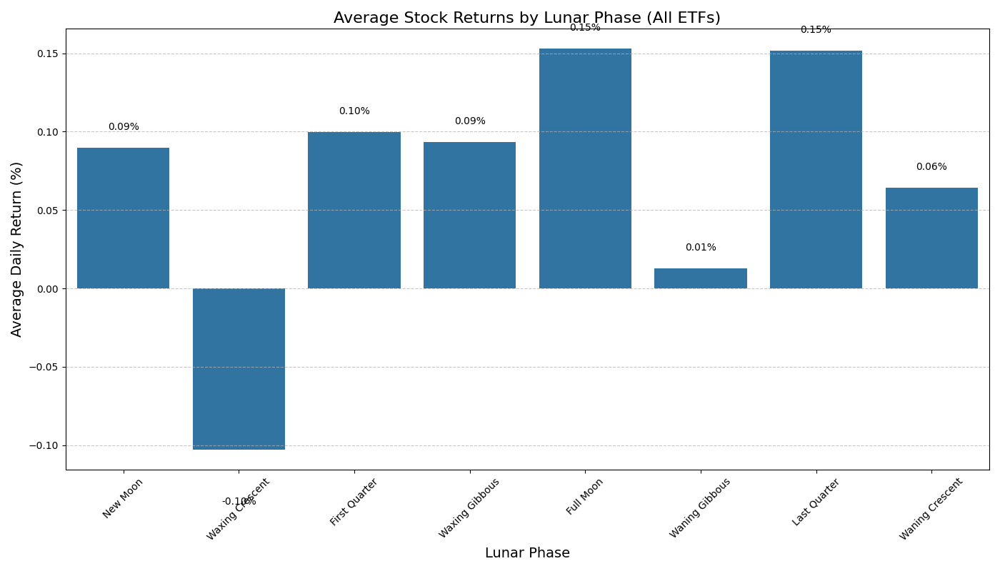

# Stock Market & Lunar Phase Analysis: Data Engineering Report

_Generated on March 12, 2025_

## Executive Summary

This data engineering project investigates the relationship between lunar cycles and stock market behavior. The project integrates stock price data for major ETFs (SPY, QQQ, DIA, IWM) with lunar phase data to determine if lunar phases have any measurable impact on stock market returns or trading volume.

### Project Objectives

- Create a scalable Azure-based data pipeline for stock and lunar data
- Merge market data with lunar cycles for correlation analysis
- Analyze stock returns and trading volume by lunar phase
- Determine the statistical significance of any observed relationships

### Key Findings

- Correlations between lunar phases and stock metrics are negligible (all below 0.03)
- Only DIA (Dow 30 ETF) shows statistically significant volume variation by lunar phase (p=0.0069)
- Return differences across lunar phases are not statistically significant
- Full Moon and Last Quarter phases show marginally higher average returns (0.15%), while Waxing Crescent shows lowest returns (-0.10%)

### Conclusion

The data does not support the hypothesis that lunar phases meaningfully influence stock market behavior. The statistically significant volume variation for DIA is interesting but has limited practical application given the weak correlation strength (0.0197).

## Data Pipeline Overview

### Architecture Diagram

```
┌─────────────┐    ┌───────────────┐    ┌────────────────┐    ┌───────────────┐    ┌─────────────────┐
│ Data Sources│    │ Azure Blob    │    │ Azure SQL      │    │ Analysis &    │    │ Reporting &     │
│             │───>│ Storage       │───>│ Database       │───>│ Statistics    │───>│ Visualization   │
└─────────────┘    └───────────────┘    └────────────────┘    └───────────────┘    └─────────────────┘
     │                    │                    │                     │                     │
     ▼                    ▼                    ▼                     ▼                     ▼
┌─────────────┐    ┌───────────────┐    ┌────────────────┐    ┌───────────────┐    ┌─────────────────┐
│- Yahoo      │    │- Raw Stock    │    │- SPY_StockPrices│    │- Correlations │    │- Markdown      │
│  Finance API│    │  Container    │    │- QQQ_StockPrices│    │- ANOVA Tests  │    │  Reports       │
│- NASA Lunar │    │- Raw Lunar    │    │- DIA_StockPrices│    │- Average      │    │- Visualizations│
│  API        │    │  Container    │    │- IWM_StockPrices│    │  Returns      │    │- Azure         │
│             │    │               │    │- LunarPhases    │    │               │    │  Dashboard     │
└─────────────┘    └───────────────┘    └────────────────┘    └───────────────┘    └─────────────────┘
```

### Pipeline Components

1. **Data Extraction**

   - Stock data extracted from Yahoo Finance API (prices and volume for SPY, QQQ, DIA, IWM)
   - Lunar phase data extracted from NASA API
   - Python scripts automate the extraction process

2. **Data Storage**

   - Raw data stored in Azure Blob Storage (separate containers for stock and lunar data)
   - SAS tokens used for secure access
   - Containers provide scalable, durable storage for raw data

3. **Data Processing & Database**

   - Data transferred to Azure SQL Database for structured storage and analysis
   - ETL scripts handle data cleaning, transformation, and loading
   - Stock and lunar data joined on date for integrated analysis

4. **Analysis & Statistics**

   - Correlation analysis between lunar phases and stock metrics
   - ANOVA tests to detect statistically significant differences
   - Statistical calculations performed in Python with scipy and pandas

5. **Reporting & Visualization**

   - Automated report generation using Python
   - Data visualizations created with matplotlib and seaborn
   - Results stored in SQL tables for future reference

6. **Automation**
   - Azure Automation Account with Python Runbooks
   - PowerShell scripts orchestrate the analysis workflow
   - Scheduled weekly execution for ongoing monitoring

## Data Insights & Visualizations

### 1. Stock Price Trends

The analysis covered daily stock price data for major ETFs over a period of approximately 5 years (1,255 trading days per ETF). The correlation with lunar phases was examined to identify any potential patterns.

### 2. Correlation Analysis (Heatmap)

The heatmap below shows the correlation between lunar phases and various stock metrics:



**Key Insights:**

- All correlations between lunar phases and stock metrics are extremely weak (< 0.03)
- Close prices show slightly negative correlations with lunar phase
- Trading volume shows slightly positive correlations with lunar phase
- Return correlations are negligibly positive

### 3. Stock Returns by Lunar Phase (Bar Chart)

The following chart shows the average daily returns (%) for each lunar phase across all ETFs:



**Key Insights:**

- Full Moon and Last Quarter phases show the highest average returns (~0.15%)
- Waxing Crescent shows the lowest average returns (-0.10%)
- The pattern is not statistically significant based on ANOVA tests
- Return variations by lunar phase are inconsistent across individual ETFs

### 4. Trading Volume vs Lunar Phases (ANOVA Results)

ANOVA tests were performed to determine if trading volume varies significantly across lunar phases:

| ETF | Correlation_Volume | ANOVA_F_Statistic | ANOVA_P_Value | Conclusion                                     |
| --- | ------------------ | ----------------- | ------------- | ---------------------------------------------- |
| DIA | 0.0197             | 2.7952            | 0.0069        | Significant volume variation by lunar phase    |
| QQQ | 0.0259             | 1.6982            | 0.1054        | No significant volume variation by lunar phase |
| IWM | 0.0206             | 1.4112            | 0.1967        | No significant volume variation by lunar phase |
| SPY | 0.0199             | 1.8192            | 0.0799        | No significant volume variation by lunar phase |

**Key Insights:**

- Only DIA shows statistically significant volume variation by lunar phase (p < 0.05)
- All correlation values are very weak (< 0.03)
- The F-statistic for DIA (2.7952) indicates some meaningful variation, but the correlation strength limits practical applications

### 5. Stock Returns by Lunar Phase (ANOVA Results)

ANOVA tests for stock returns across lunar phases:

| ETF | ANOVA_F_Statistic | ANOVA_P_Value | Statistically Significant |
| --- | ----------------- | ------------- | ------------------------- |
| SPY | 0.6485            | 0.7159        | No                        |
| QQQ | 0.6551            | 0.7103        | No                        |
| DIA | 0.8439            | 0.5509        | No                        |
| IWM | 0.5564            | 0.7916        | No                        |

**Key Insights:**

- None of the ETFs show statistically significant return variations by lunar phase
- P-values are well above the 0.05 threshold for significance
- Any observed return patterns are likely due to random chance

### 6. Final Data Tables

**LunarPhaseReturns Table**

- Contains average daily returns for each ETF and lunar phase
- Includes sample count for statistical validity
- Updated automatically with each analysis run

**StockLunarAnalysisResults Table**

- Stores ANOVA test results for volume and returns by lunar phase
- Tracks correlation values between lunar phases and trading volume
- Provides statistical significance conclusions
- Updated weekly via automation

## SQL Queries & Data Access

Key SQL queries used for analysis:

```sql
-- Join stock prices with lunar phases
SELECT s.[Date], s.[Open], s.[High], s.[Low], s.[Close], s.[Volume], l.[Phase]
FROM SPY_StockPrices s
JOIN LunarPhases l ON CAST(s.[Date] AS DATE) = CAST(l.[Date] AS DATE)
ORDER BY s.[Date];

-- Query for average returns by lunar phase for all ETFs
SELECT lr.LunarPhase,
       AVG(CASE WHEN lr.ETF = 'SPY' THEN lr.AverageReturn END) AS SPY_Return,
       AVG(CASE WHEN lr.ETF = 'QQQ' THEN lr.AverageReturn END) AS QQQ_Return,
       AVG(CASE WHEN lr.ETF = 'DIA' THEN lr.AverageReturn END) AS DIA_Return,
       AVG(CASE WHEN lr.ETF = 'IWM' THEN lr.AverageReturn END) AS IWM_Return,
       AVG(lr.AverageReturn) AS Average_Return
FROM LunarPhaseReturns lr
GROUP BY lr.LunarPhase
ORDER BY
    CASE lr.LunarPhase
        WHEN 'New Moon' THEN 1
        WHEN 'Waxing Crescent' THEN 2
        WHEN 'First Quarter' THEN 3
        WHEN 'Waxing Gibbous' THEN 4
        WHEN 'Full Moon' THEN 5
        WHEN 'Waning Gibbous' THEN 6
        WHEN 'Last Quarter' THEN 7
        WHEN 'Waning Crescent' THEN 8
    END;
```

## Conclusion & Business Impact

### Summary of Findings

This analysis challenges the notion that lunar cycles influence stock market behavior in any meaningful way. While there are some variations in returns and trading volume across different lunar phases, these differences are generally:

1. Very small in magnitude (correlations < 0.03)
2. Not statistically significant for most metrics
3. Inconsistent across different ETFs
4. Likely attributable to random variation rather than lunar influence

The one exception is DIA (Dow 30 ETF), which shows statistically significant trading volume variation by lunar phase. However, the correlation is still very weak (0.0197), limiting its practical application.

### Practical Applications

Despite the lack of strong lunar influence, this project provides:

1. **Data Infrastructure Value**: The Azure-based data pipeline provides a scalable, automated framework for ongoing market analysis that can be extended to other factors
2. **Methodology Template**: The statistical approach can be applied to analyze other potential market influences
3. **Market Behavior Insights**: The analysis confirms that major ETFs generally follow rational economic principles rather than astronomical influences
4. **Data-Driven Decision Making**: Demonstrates how empirical analysis can test and disprove popular market theories

### Future Improvements

1. **Expanded Data Sources**: Include additional market data (volatility indices, sector ETFs, commodities)
2. **Advanced Analytics**: Apply machine learning for pattern recognition beyond simple statistical tests
3. **Real-Time Processing**: Enhance the pipeline to support near-real-time data for more timely insights
4. **Alternative Factors**: Analyze other potential market influences (seasonality, day of week, economic indicators)
5. **Dashboard Development**: Create an interactive Power BI dashboard for exploring the relationships visually

### Final Thoughts

This project demonstrates the value of robust data engineering practices in financial analysis. While the lunar cycle hypothesis was not supported, the infrastructure and methodology developed provide a foundation for ongoing market analysis. The automated pipeline ensures that as new data becomes available, the analysis can be refreshed with minimal effort, supporting data-driven decision making.

---

_Report prepared by the Data Engineering Team_
_For questions or further details, please contact the project team_
