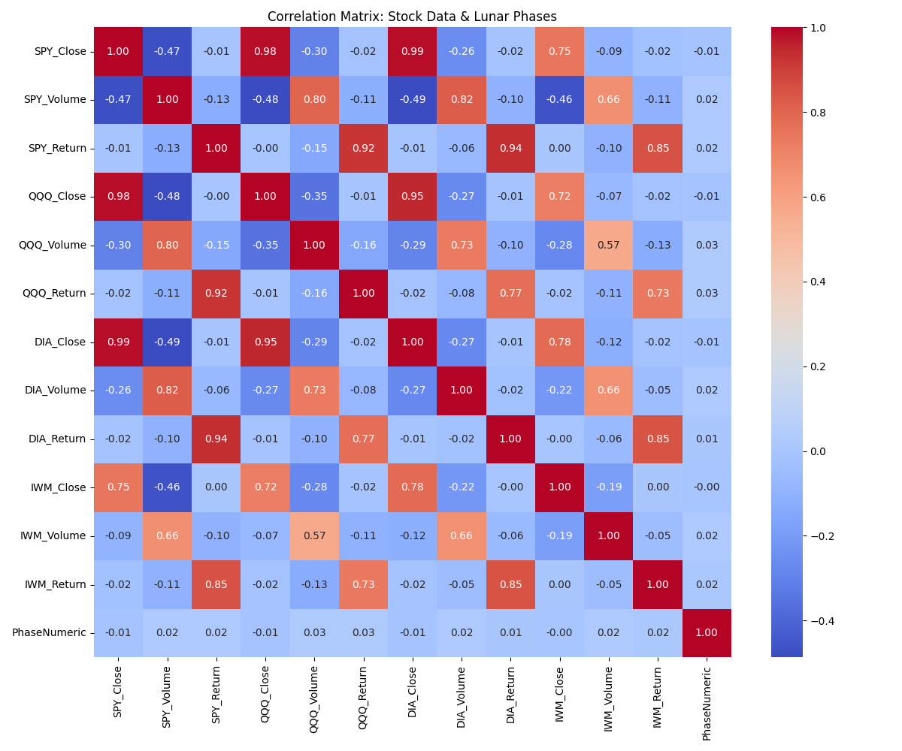

# Visualizations Directory

This directory contains visualizations generated from the Stock Market & Lunar Phase Analysis project.

## Available Visualizations

1. `correlation_heatmap.png` - Heatmap showing correlations between lunar phases and stock metrics
2. `returns_by_lunar_phase.png` - Bar chart displaying average stock returns by lunar phase

## Visualization Details

### Correlation Heatmap

The correlation heatmap visualizes the relationship between lunar phases and various stock metrics:

- Close prices for each ETF
- Trading volume for each ETF
- Daily returns for each ETF

The color scale ranges from blue (negative correlation) through white (no correlation) to red (positive correlation).

### Returns by Lunar Phase

This bar chart shows the average daily returns (in percentage) for each lunar phase across all ETFs:

- New Moon
- Waxing Crescent
- First Quarter
- Waxing Gibbous
- Full Moon
- Waning Gibbous
- Last Quarter
- Waning Crescent

The chart includes the actual percentage values above each bar.

## Generation Process

These visualizations are automatically generated by the `azure_stock_lunar_analysis.py` script using:

- matplotlib for creating the base plots
- seaborn for enhancing the visual aesthetics
- pandas for data manipulation

## Usage

These visualizations are referenced in the data engineering report and can be used for presentations or dashboards. They are automatically regenerated each time the analysis script runs, ensuring they reflect the most recent data.
